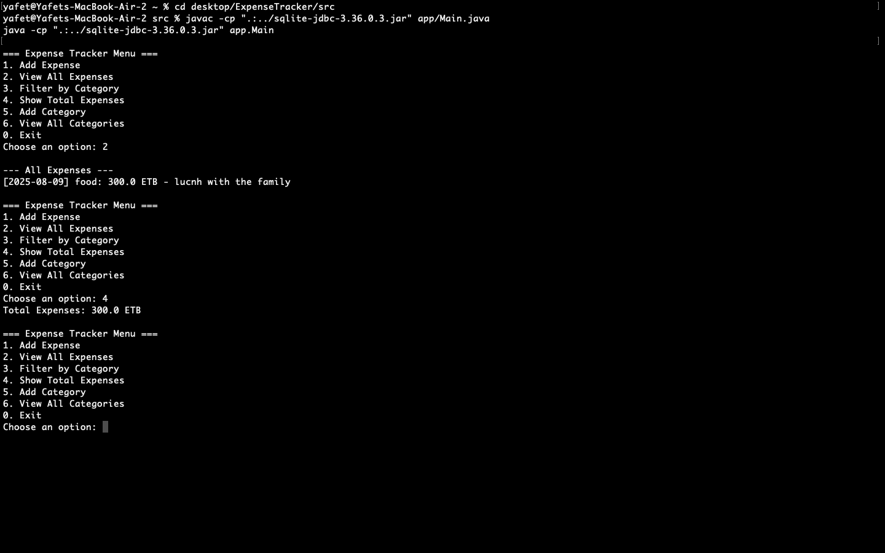

# Expense Tracker (Java CLI Application)

A simple but complete Java console application that allows users to track their expenses, view totals, filter by category, and manage custom categories — all built using Object-Oriented Programming principles.

---

## 📌 Features

- Add and view expenses
- Filter expenses by category
- View total expenses
- Add custom categories
- View all categories
- Input validation and custom exceptions
- File logging of all added expenses
- SQLite database integration via JDBC
- Clean package-based architecture

---

## 🧠 Technologies Used

- Java 17
- JDBC with SQLite
- BufferedReader/Writer for File I/O
- Collections (`List`, `Map`)
- Exception Handling (including a custom exception class)

---

## 📁 Project Structure

````
ExpenseTracker/
├── sqlite-jdbc-3.36.0.3.jar# JDBC driver (must be added)
└── src/
    ├── app/Main.java
    ├── model/Expense.java
    ├── abstractclass/User.java
    ├── interfaces/Filterable.java
    ├── exceptions/InvalidExpenseException.java
    ├── dao/ExpenseDAO.java
    ├── service/ExpenseService.java
    ├── ui/MainCLI.java
    └── util/
        ├── DBUtil.java
        └── FileLogger.java
``` └── log.txt             # Action logs (auto-generated)
    └── config.txt          # Database connection config
    └── expenses.db         # SQLite database (auto-generated)
└── Readme.md
---

## 🚀 How to Run

### 1. Make sure you have:

- Java installed (Java 11 or higher)
- SQLite JDBC JAR file placed in root (`ExpenseTracker/sqlite-jdbc-3.36.0.3.jar`)
- `config.txt` in the same directory you're running from (or inside `src/` if compiling there)

### 2. Compile & Run

**From the `src/` folder:**

```bash
javac -cp ".:../sqlite-jdbc-3.36.0.3.jar" app/Main.java
java -cp ".:../sqlite-jdbc-3.36.0.3.jar" app.Main
````

> If you're using Windows, replace `:` with `;` in the classpath.

---

## 👨‍💻 Team

| Name | Role                    |
| ---- | ----------------------- |
|Yafet Aklilu| Abstractclass + App |
|Biruk Gebre| DAO + util + ui|
|Yomlata Assefa| Model + Service |
|Mikiyas Zewdu| Exceptions + Interfaces|

---

## ✅ Requirements Covered

- 8+ Java classes ✅
- At least 2 interfaces and 1 abstract class ✅
- Proper inheritance and polymorphism ✅
- Use of List + Map ✅
- JDBC with PreparedStatement ✅
- 2 tables: `expenses`, `categories` ✅
- File I/O using BufferedReader/Writer ✅
- Custom Exception ✅
- CLI menu-based interface ✅


